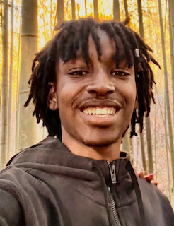
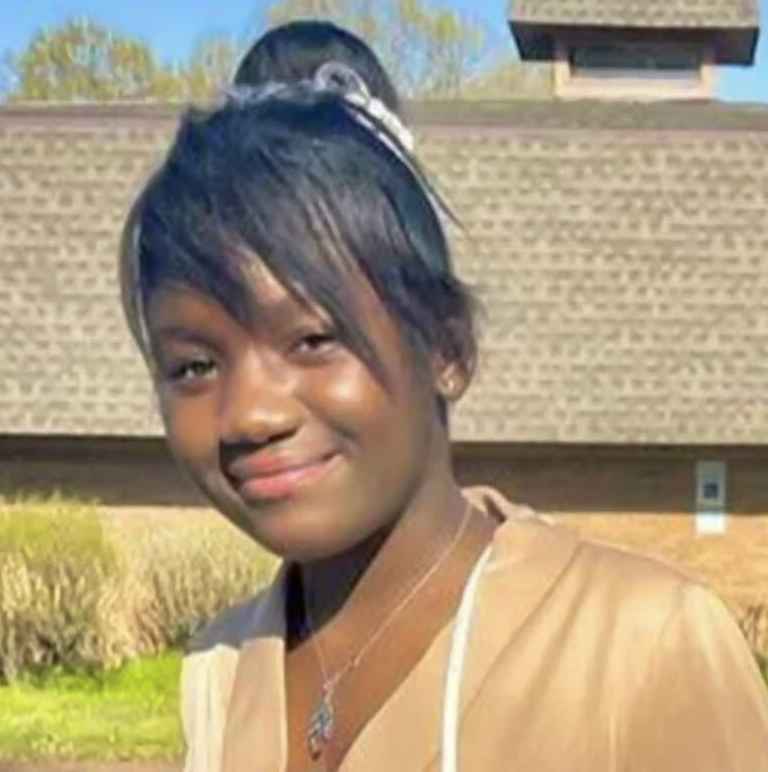
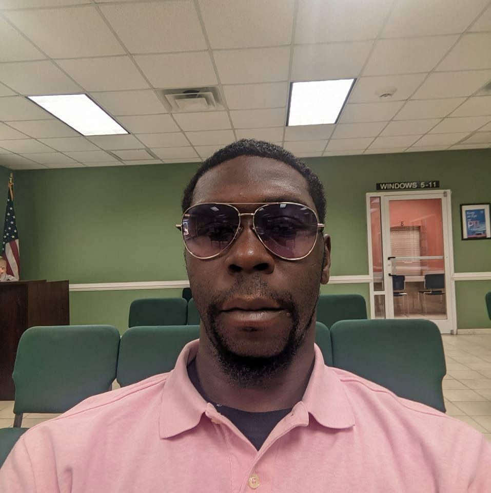

# Overview

In 2026, Black men, women and children have been found hanging from trees, on church grounds, outside cafeterias and in parking lots across the United States. In almost every case, officials moved quickly to call the death a suicide, often within days. Families, activists and many in the Black community have refused to accept those rulings without answers.

This story documents the 2026 cases that have driven the national conversation. For each one, it sets what the authorities have concluded beside what the families are saying. Some of these deaths may be exactly what officials say they are. Others may not be. The point is that, in a country with this history, "trust us" is not an investigation.

# Why the Word "Lynching" Still Matters

Lynching was never just a method of killing. It was a public message meant to terrorize Black communities into submission, and it was routinely covered up by the same local officials who were supposed to investigate it. More than 4,000 Black Americans were lynched between the end of Reconstruction and the mid-20th century, and almost no one was ever held accountable.

That history is why a Black body found hanging from a tree in Mississippi, Georgia or North Carolina is not "just" a death investigation. Experts note that lynching is one of the hardest hate crimes to prove and has historically been recorded as suicide. A February 2026 report highlighted by TheGrio counted more than 70 suspected modern-day lynchings in seven Deep South states since 2000. Mississippi had the most, with 20. The report also pointed out how low the bar is to serve as a coroner in some of these states.

# Where It Happened

```{r}
#| column: screen
#| message: false

library(tidyverse)
library(leaflet)
library(htmltools)

lynchings <- read_csv('lynchings.csv', show_col_types = FALSE) |>
  mutate(
    period = if_else(year == 2026, '2026', '2024–2025'),
    name   = str_replace(Victim, '^unidentified', 'Unidentified'),
    place  = if_else(is.na(City), State, str_c(City, ', ', State)),
    when   = if_else(is.na(Date) | Date == 'Unknown', 'Date unknown', Date),
    age    = if_else(is.na(Age), '', str_c(', ', Age)),
    note   = if_else(Approximate == 'Yes', '<br><i>Date or location approximate</i>', ''),
    popup  = str_c('<b>', htmlEscape(name), '</b>', age, '<br>',
                   htmlEscape(place), '<br>', when, note)
  )

pal <- colorFactor(c('#b2182b', '#6b6b6b'), levels = c('2026', '2024–2025'))

leaflet(lynchings, height = 520,
        options = leafletOptions(zoomControl = FALSE)) |>
  addProviderTiles("Stadia.StamenToner") |>
  addCircleMarkers(
    lng = ~lng, lat = ~lat,
    radius = 8, weight = 2,
    color = ~pal(period), fillColor = ~pal(period),
    fillOpacity = ~if_else(Approximate == 'Yes', 0.25, 0.85),
    popup = ~popup,
    label = ~name
  ) |>
  addLegend('bottomright', pal = pal, values = ~period,
            title = 'Year found', opacity = 1) |>
  fitBounds(min(lynchings$lng), min(lynchings$lat),
            max(lynchings$lng), max(lynchings$lat),
            options = list(padding = c(60, 60)))
```

Each circle marks where a Black American was found dead in a case the community has questioned. Red circles are 2026 cases, and gray circles are earlier ones from 2024–2025. Faded circles mean the date or location is approximate. Click a circle for details.

# The 2026 Cases

| Photo | Name | Age | Location | Found | Official Finding | What the Family / Community Says |
|:---------:|-----------|----------:|-----------|-----------|-----------|-----------|
| {width="80px"} | **Kyle Bassinga** | 21 | Marietta (Cobb County), Georgia | Feb 18 | Suicide; police cite video of him entering the woods alone | Questions about the speed of the ruling |
| {width="80px"} | **Juliana Umba Nzita** | 16 | Charlotte, North Carolina | May 8 | Suicide, ruled within three days; no evidence of foul play | Relatives doubted the ruling and demanded an autopsy; she had been missing for 11 days |
| {width="80px"} | **To'Nea Nicole Miller** | 27 | Gwen Cherry Park, Liberty City, Miami, Florida | June 18 | "Consistent with a suicide," per the Miami-Dade Sheriff's Office and medical examiner | Her sister publicly rejected the ruling; #JusticeForTonea spread nationally. She was visiting from Flint, Michigan, for Juneteenth |
| {width="80px"} | **Justice Kai James** | 21 | Turner Job Corps, Albany, Georgia | June 21 | Under investigation by Albany police; police chief addressed "rumors" | Family disputes that he took his own life and has raised concerns about access to surveillance footage |
| {width="80px"} | **Jerard "Jay" Jackson** | 28 | Rothbury, Michigan (near a music festival) | June 30 | Suicide (preliminary) | Family disputes the finding; he had no prior mental-illness diagnosis |
| {width="80px"} | **Nolan Xavier Wells** | 18 | Shoreline of Horn Island, off Ocean Springs, Mississippi | July 6 | Cause of death undetermined by the state medical examiner, but consistent with drowning. The state autopsy found no fluid or debris in his airways. On Sept 22, a grand jury declined to bring charges, finding no evidence of a crime | Went missing July 4 after a trip to the island with mostly white friends. Family disputes the drowning finding; their independent autopsy found red discoloration on the back of his skull. They say they learned of the grand jury decision by text from the DA. The Congressional Black Caucus has asked for a federal review |
| {width="80px"} | **Tasia Fortune** | 29 | Behind a vacant home, Jackson, Mississippi | Aug 3 | **Homicide.** Police say she was killed in a drug dispute and the hanging was staged afterward; three men have been charged with murder | Her mother: "She did not do this to herself." The family says she fought for her life |
| {width="80px"} | **Unnamed man** | 32 | Downtown parking lot, Raleigh, North Carolina | August | Suicide; police say video shows him alone | Family has not disputed the ruling publicly |
| {width="80px"} | **Demetrius Fleming** | 38 | Roanoke Rapids, North Carolina | Aug 21 | "Equivocal": still under investigation | Police chief acknowledged "the implications surrounding the death of a Black man by hanging" |
| {width="80px"} | **Unnamed man** | — | Near Upper Marlboro, Maryland | Sept 20 | Suicide, ruled the next day; no other signs of trauma | Family asked that his name not be released; police say the investigation continues |

: Black Americans whose 2026 deaths are being questioned, as of early October {.striped .hover tbl-colwidths="\[10,12,5,15,6,26,26\]"}

## To'Nea Nicole Miller: Juneteenth weekend in Miami

To'Nea traveled from Flint, Michigan, to Miami to celebrate Juneteenth. In the early hours of June 18, the day before the holiday, she was found hanging from a tree near Gwen Cherry Park in Liberty City. The Sheriff's Office and the county medical examiner said they found no evidence of foul play and that her death was "consistent with a suicide."

Her older sister, Teri Miller, stood in that same park on June 26 and rejected that conclusion. The case received little mainstream coverage at first. It spread through Instagram, X and Black independent media, and then Color Of Change and others organized around #JusticeForTonea.

## Tasia Fortune: what "staged" means

Tasia Fortune, a 29-year-old mother of four, was found hanging from a tree behind an abandoned house in Jackson on August 3. Many in our community immediately asked whether Mississippi had seen another lynching.

The investigation has since gone in a different direction. A Jackson police detective testified that Tasia died in a dispute over drugs, that she "fought hard with her attackers," and that the medical examiner concluded the hanging was staged after her death. Three men have been charged with murder: Jarques Ratliff, Earnest Lloyd Jr. and Eric Clark. All three are Black. Ratliff has pleaded not guilty, and the case is now with a grand jury.

Tasia's case is still a murder, and someone still chose to hang a Black woman's body from a tree in Mississippi. But it is not a racially motivated lynching as the evidence currently stands, and we should be honest about that. Credibility is the only weapon we have when we say the other rulings do not add up.

## Justice Kai James: Job Corps, Albany, Georgia

Justice Kai James, 21, was found hanging outside the cafeteria of the Turner Job Corps center in Albany on the night of June 21. Bystanders performed CPR, and he was pronounced dead at Phoebe Putney Memorial Hospital shortly before 10 p.m. His family says he did not take his own life and has pushed for full access to the surveillance footage from that night.

# Not a Hanging, But the Same Question: Nolan Wells

The case that has dominated Black media this summer did not involve a rope at all.

**Nolan Xavier Wells**, 18, of Ocean Springs, Mississippi, was a wide receiver at Southwest Mississippi Community College. On July 4 he went to Horn Island, a barrier island about five miles off the Mississippi coast, for an Independence Day gathering with a group of mostly white friends. He did not come back on the boat. His body was found on the island's shoreline on July 6.

-   **The state medical examiner** listed the cause of death as **undetermined**, though consistent with drowning. The state autopsy also found **no fluid or debris in his airways** and an empty stomach.
-   **The family's independent autopsy**, by Dr. Roger A. Mitchell Jr., found red discoloration on the back of his skull but could not determine the manner of death without further investigation.
-   **On September 22**, a 23-member Jackson County grand jury reviewed phone forensics, GPS data, camera footage, 132 subpoenas and testimony from 43 witnesses. It **declined to bring charges**, concluding that Nolan "chose to remain" on the island, was not in any altercation, and that his death was consistent with drowning, a "diagnosis by exclusion."
-   His family says they learned of the decision **by text message from the district attorney**. Benjamin Crump has since released phone data he says contradicts the friends' accounts. The Congressional Black Caucus has asked the Justice Department for a federal review, and students across the Atlanta University Center have marched demanding answers.

A grand jury has spoken. Nolan's family, and a large part of Black America, are still asking how an 18-year-old was left on an island and found dead two days later, apparently without anyone being responsible.

# The Pattern

Taken together, these cases share a pattern that goes beyond any single death:

1.  **Speed.** Suicide rulings arrive within one to three days, often before families have seen footage or autopsy results.
2.  **Control of evidence.** Families repeatedly have to fight for surveillance video, phone data and full autopsy reports.
3.  **Communication.** Families learn of key decisions through press releases, rumors, or a text message.
4.  **History.** All of this happens in places where officials once covered up actual lynchings, and families have every reason to demand proof.

A suicide ruling may sometimes be correct. Mental-health crises in our communities are real and deserve attention too. But a correct ruling and a trusted ruling are not the same thing, and trust has to be earned through transparency.

# What Families and Advocates Are Demanding

-   Independent autopsies, paid for by the state, whenever a Black person is found hanging
-   Prompt release of surveillance footage and investigative files to families
-   Federal civil-rights review when local officials have a conflict of interest
-   An end to elected or minimally qualified coroners making final calls on suspicious deaths

# Conclusion

Whether each of these deaths turns out to be suicide, murder or something in between, Black families deserve full answers, not quick rulings. In 2026, getting those answers still depends on families, independent journalists and the community refusing to look away.

*If you or someone you know is struggling, call or text **988** (Suicide & Crisis Lifeline) in the U.S.*

# Sources

-   [Death of Nolan Wells (Wikipedia)](https://en.wikipedia.org/wiki/Death_of_Nolan_Wells)
-   [NPR: Grand jury finds no evidence of criminal conduct in the death of Nolan Wells](https://www.npr.org/2026/09/22/nx-s1-5911804/nolan-wells-investigation-grand-jury)
-   [NPR: Questions remain after grand jury declines indictment in Nolan Wells' death](https://www.npr.org/2026/09/22/nx-s1-5977673/questions-remain-after-grand-jury-declines-indictment-in-nolan-wells-death)
-   [WLOX: Grand jury finds no foul play in death of Nolan Wells](https://www.wlox.com/2026/09/22/grand-jury-returns-no-true-bill-nolan-wells-case/)
-   [The Miami Times: To'Nea Miller's sister disputes suicide conclusion](https://www.miamitimesonline.com/news/local/tonea-miller-death-sister-disputes-miami-dade-sheriffs-suicide-conclusion/article_64f947bc-cdc1-45f9-84a5-5b83545ac338.html)
-   [Color Of Change: Justice for Tonea Nicole Miller](https://colorofchange.org/organizefor/community-letter-of-support-for-justice-for-tonea-nicole-miller/)
-   [PBS NewsHour: Police say Tasia Fortune's hanging was "staged"](https://www.pbs.org/newshour/nation/mississippi-police-say-tasia-fortunes-hanging-was-staged-after-her-death-in-a-drug-dispute)
-   [Mississippi Free Press: Tasia Fortune identified](https://www.mississippifreepress.org/tasia-fortune-identified-as-woman-found-hanging-in-tree-behind-vacant-jackson-home/)
-   [NBC News: Third suspect arrested in Tasia Fortune's death](https://www.nbcnews.com/news/us-news/third-suspect-arrested-death-mississippi-woman-found-hanging-tree-rcna599617)
-   [WALB: Family demands answers following Turner Job Corps death](https://www.walb.com/2026/06/26/i-want-know-what-happened-my-baby/)
-   [TheGrio via Yahoo News: Black people are being found hanging from trees. Why are officials so quick to call it suicide?](https://www.yahoo.com/news/us/articles/black-people-being-found-hanging-180000701.html)
-   [WHUR: Black people found hanging in 2026](https://whur.com/whur/black-people-found-hanging-2026-new-cases-raise-questions-calls-for-independent-investigations/)
-   [Atlanta Black Star: Maryland man found hanging, ruled a suicide](https://atlantablackstar.com/2026/09/24/black-man-found-hanging-from-tree-death-ruled-a-suicide/)
-   [NewsOne: Black people found hanging in 2026](https://newsone.com/6871450/black-people-found-hanging-2026/)